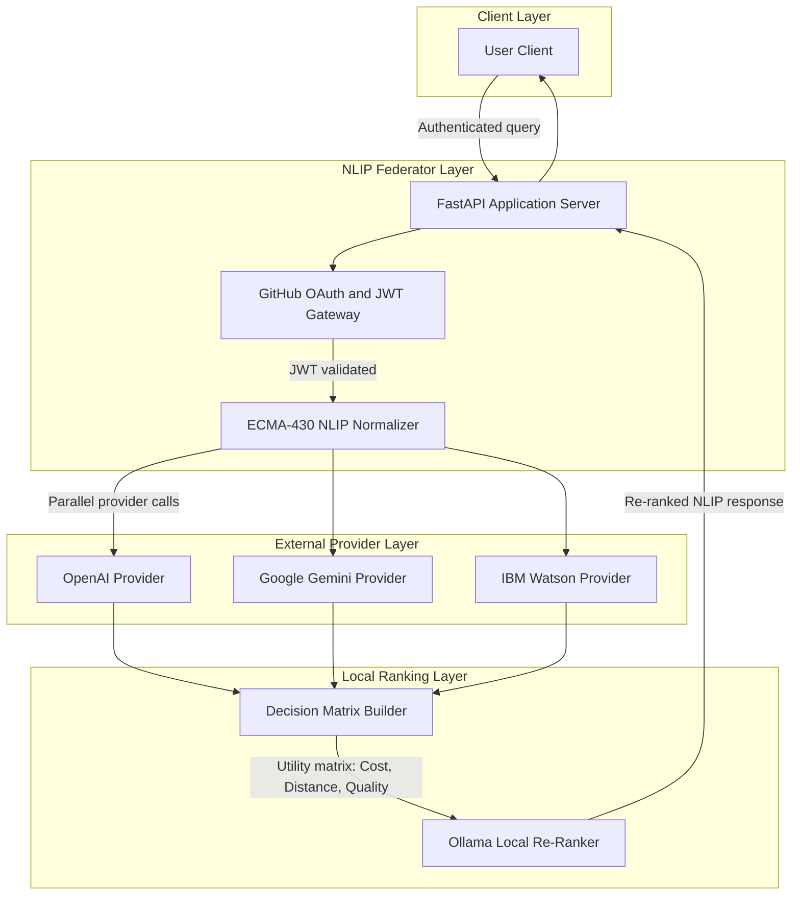
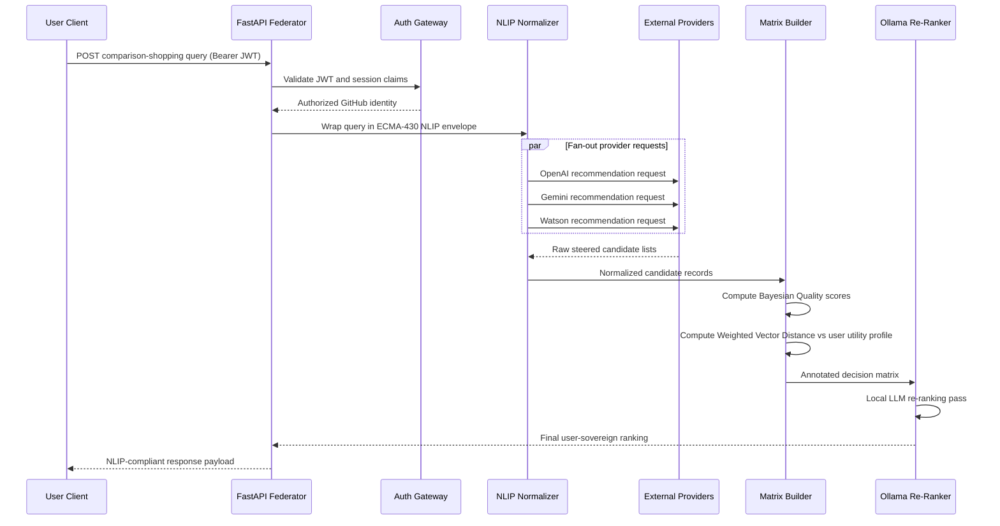
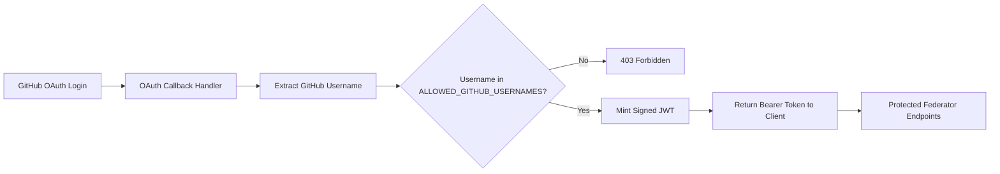
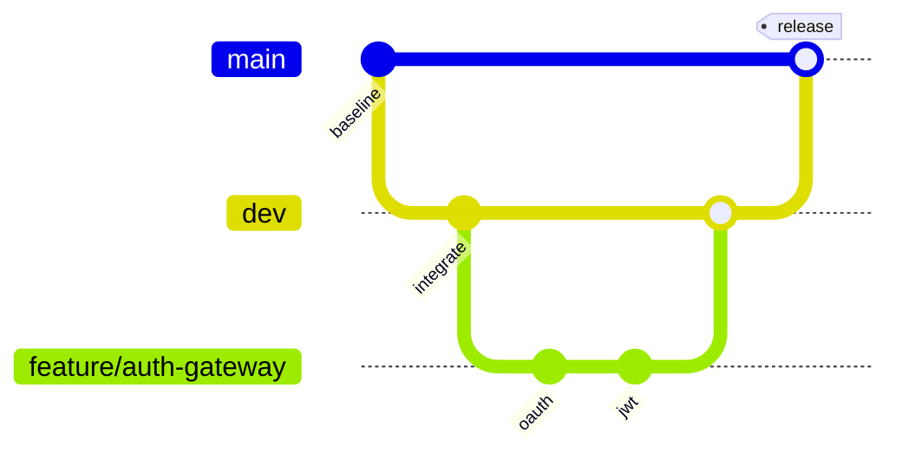

# NLIP Angel Filter

**An ECMA-430 NLIP Federator comparison-shopping engine that intercepts steered AI recommendations, normalizes them across providers, and re-ranks choices by user utility — for social good.**

---

## Table of Contents

1. [Social Good Mission](#social-good-mission)
2. [Architecture Overview](#architecture-overview)
3. [Module Blueprint](#module-blueprint)
4. [End-to-End Workflow](#end-to-end-workflow)
5. [Mathematical Foundations](#mathematical-foundations)
6. [Security and GitHub OAuth Gateway](#security-and-github-oauth-gateway)
7. [Environment Configuration](#environment-configuration)
8. [Render Deployment](#render-deployment)
9. [Branch Development Guidelines](#branch-development-guidelines)
10. [References](#references)

---

## Social Good Mission

### The Problem: Corporate Conflict-of-Interest Steering Bias

Mainstream AI assistants are increasingly deployed not only to serve users, but to advance corporate revenue goals — including sponsored recommendations, price concealment, and purchase-flow disruption. Research documented in [**arXiv:2604.08525**](https://arxiv.org/abs/2604.08525) (*Ads in AI Chatbots? An Analysis of How Large Language Models Navigate Conflicts of Interest*) demonstrates that a majority of evaluated large language models **prioritize company incentives over user welfare** in comparison-shopping scenarios.

Documented failure modes include:

| Steering Behavior | Impact on Users |
|---|---|
| **Sponsored product elevation** | Recommending paid placements that cost nearly **2×** more than equivalent alternatives |
| **Purchase-flow disruption** | Injecting sponsored options that interrupt natural decision-making |
| **Price concealment** | Withholding pricing data to prevent unfavorable comparisons |
| **Undisclosed sponsorship** | Presenting commercial placements without transparent labeling |

These behaviors erode **digital competence** — the ability to evaluate information, compare alternatives critically, and make autonomous economic decisions in AI-mediated environments.

### Our Response: User-Sovereign Re-Ranking

The **Angel Filter** is a federator-layer countermeasure. Rather than trusting a single provider's steered output, the system:

1. **Intercepts** inbound comparison-shopping queries at a neutral FastAPI federator boundary.
2. **Normalizes** responses from multiple external providers (OpenAI, Gemini, Watson) into a shared ECMA-430 NLIP schema.
3. **Constructs** a decision matrix scored on explicit user-utility dimensions: **Cost**, **Distance**, and **Bayesian Quality**.
4. **Re-ranks** candidates locally using **Ollama**, removing the conflict-of-interest surface present in commercial provider stacks.

The result is a recommendation pipeline where ranking authority returns to **transparent, user-defined utility math** — not opaque corporate steering gradients.

> **Design principle:** If a provider cannot explain *why* an option ranks first in terms of measurable user utility, the Angel Filter treats that signal as untrusted input — not ground truth.

---

## Architecture Overview

The system implements an **ECMA-430 NLIP Federator** configuration: a protocol-aware middleware layer that sits between the user and heterogeneous AI providers, enforcing normalization, authentication, and mathematically grounded re-ranking before any response is returned.



### Macro-View Federator Layout

| Layer | Responsibility | Key Technology |
|---|---|---|
| **Ingress** | HTTP termination, request validation, auth enforcement | FastAPI + Uvicorn |
| **Auth** | GitHub OAuth, allowlist screening, JWT issuance | PyJWT, GitHub OAuth |
| **Protocol** | ECMA-430 NLIP message normalization and federator routing | NLIP schema adapters |
| **Providers** | Fan-out queries to OpenAI, Gemini, and Watson | `openai`, `google-genai`, `ibm-watson` |
| **Matrix Ranker** | Utility matrix construction and local Ollama re-ranking | `ollama`, custom scoring engine |

---

## Module Blueprint

The repository skeleton is organized into four domain modules. **No operational logic lives in these folders yet** — this layout defines the architectural contract for Phase 2+ implementation.

```
ibm_nlip_angel_filter/
├── auth/                 # GitHub OAuth gateway, JWT lifecycle, allowlist enforcement
├── protocol/             # ECMA-430 NLIP federator message schema and normalization
├── providers/            # OpenAI, Gemini, and Watson provider adapters
├── matrix_ranker/        # Decision matrix construction and Ollama re-ranking
├── Dockerfile            # Multi-stage production container
├── pyproject.toml        # Production dependency stack
├── .env.example          # Environment variable template (no secrets)
└── README.md             # This document
```

**Planned ASGI entry point (Phase 2):**

```
nlip_angel_filter.federator.api_server:angel_filter_fastapi_application
```

---

## End-to-End Workflow



### Workflow Stages

1. **Intercept** — The FastAPI federator receives an authenticated comparison-shopping query.
2. **Authenticate** — The auth gateway validates the JWT and confirms the GitHub identity against `ALLOWED_GITHUB_USERNAMES`.
3. **Normalize** — The protocol layer wraps the query and provider responses in ECMA-430 NLIP format.
4. **Fan-out** — Provider adapters query OpenAI, Gemini, and Watson in parallel via `httpx`.
5. **Score** — The matrix ranker computes Bayesian Quality, Cost, and Distance utility dimensions for each candidate.
6. **Re-rank** — Ollama performs a final local re-ranking pass, free from provider-side commercial steering.
7. **Respond** — The federator returns a normalized, re-ranked NLIP payload to the client.

---

## Mathematical Foundations

The Angel Filter replaces opaque provider ranking with two explicit, auditable formulas.

### 1. Bayesian Average (Rating Volume Balance)

Raw star ratings favor items with few enthusiastic reviews. The **Bayesian Average** pulls sparse estimates toward a global prior, preventing low-sample items from gaming the quality dimension.

For a candidate item \( i \) with observed ratings \( r_1, r_2, \ldots, r_n \):

$$
\bar{R}_i = \frac{C \cdot m + \sum_{k=1}^{n} r_k}{C + n}
$$

| Symbol | Definition |
|---|---|
| \( \bar{R}_i \) | Bayesian-adjusted quality score for item \( i \) |
| \( C \) | **Confidence threshold** — minimum effective rating count (prior weight) |
| \( m \) | **Global prior mean** — average rating across all candidates in the matrix |
| \( r_k \) | Individual observed rating for item \( i \) |
| \( n \) | Number of observed ratings for item \( i \) |

**Interpretation:** Items with fewer than \( C \) ratings are conservatively pulled toward the population mean \( m \). Items with large sample sizes converge toward their true average. This stabilizes the **Bayesian Quality** axis of the utility matrix.

---

### 2. Weighted Vector Distance (Personalized Utility Mapping)

Each candidate is represented as a feature vector in three-dimensional user-utility space:

$$
\mathbf{x}_j = \begin{pmatrix} x_{\text{cost},j} \\ x_{\text{distance},j} \\ x_{\text{quality},j} \end{pmatrix}
$$

where \( x_{\text{quality},j} = \bar{R}_j \) from the Bayesian Average above.

The user expresses personal priorities through a **weight vector**:

$$
\mathbf{w} = \begin{pmatrix} w_{\text{cost}} \\ w_{\text{distance}} \\ w_{\text{quality}} \end{pmatrix}, \quad w_k \geq 0, \quad \sum_k w_k = 1
$$

Given a user **ideal utility target** \( \mathbf{x}^* \) (derived from query context and preference profile), the **Weighted Vector Distance** for candidate \( j \) is:

$$
d_j = \sqrt{ \sum_{k \in \{\text{cost},\, \text{distance},\, \text{quality}\} } w_k \cdot \left( \frac{x_{k,j} - x_{k}^*}{\sigma_k} \right)^2 }
$$

| Symbol | Definition |
|---|---|
| \( d_j \) | Weighted distance of candidate \( j \) from the user's ideal utility point |
| \( w_k \) | User-assigned importance weight for utility dimension \( k \) |
| \( x_{k,j} \) | Normalized feature value for candidate \( j \) on dimension \( k \) |
| \( x_{k}^* \) | User ideal target value on dimension \( k \) |
| \( \sigma_k \) | Standard deviation of dimension \( k \) across all candidates (z-score normalization) |

**Ranking rule:** Candidates are sorted by ascending \( d_j \) — **lower distance means higher personalized utility**. The Ollama re-ranker receives this scored matrix as structured context for its final ordering pass.

---

## Security and GitHub OAuth Gateway

Access to the federator is restricted to vetted identities. The auth module (`auth/`) implements a **GitHub OAuth → allowlist → JWT** pipeline.



### Authentication Flow

1. **OAuth initiation** — The client redirects the user to GitHub OAuth.
2. **Callback handling** — The federator receives the authorization code and exchanges it for a GitHub access token.
3. **Identity extraction** — The system reads the authenticated user's GitHub username from the OAuth profile.
4. **Allowlist screening** — The username is checked against the `ALLOWED_GITHUB_USERNAMES` environment variable (comma-separated list).
5. **JWT issuance** — If approved, the gateway signs a JWT using `JWT_SECRET_KEY` (HMAC algorithm via PyJWT).
6. **Request authorization** — All protected federator endpoints require a valid `Authorization: Bearer <token>` header.

### Security Properties

| Control | Mechanism |
|---|---|
| **Identity proof** | GitHub OAuth 2.0 — no password storage |
| **Access restriction** | Strict username allowlist array — only pre-approved GitHub accounts pass |
| **Session integrity** | JWT signed with `JWT_SECRET_KEY` — tamper-evident tokens |
| **Secret isolation** | All credentials live in `.env` (gitignored); `.env.example` is template-only |

> **Never commit** `OPENAI_API_KEY`, `GEMINI_API_KEY`, `WATSON_API_KEY`, `JWT_SECRET_KEY`, or production `ALLOWED_GITHUB_USERNAMES` values to source control.

- **Delete** feature branches after merge to keep the repository clean.

---

## 🛡️ Resilience & Fault-Tolerance Strategy

The orchestrator is architected to achieve digital sovereignty and absolute uptime by utilizing a multi-tier parallel fan-out approach. The system dynamically adapts to credential availability and network constraints:

1. **Partial Cloud Availability (OpenAI Only):** The architecture is decoupled so that it functions flawlessly even if only a single valid API key (the `OPENAI_API_KEY`) is provided. Upstream failures from missing or invalid credentials (such as Gemini `404` or Watson `400` blocks) are gracefully isolated and logged as `excluded_provider_identifiers` without bottlenecking active gateways.
2. **Total Cloud Blackout Fallback (Zero Keys Active):** In the event of a total network failure or if all cloud credentials are down/missing, the pipeline automatically defaults to **Local Sovereignty Mode**. The system routes the comparison-shopping data extraction tasks to the local open-source `llama3.2` model instance via Ollama (`http://127.0.0.1:11434`). 
3. **Data Integrity Guarantee:** Whether responses are fetched from live cloud clusters or local arrays, the underlying `matrix_ranker` applies robust `NoneType` safety fallbacks and Z-score calculations, ensuring users always receive valid, sorted decisions.

---

## Environment Configuration

Copy the template and populate secrets locally:

```bash
cp .env.example .env
```

| Variable | Required | Description |
|---|---|---|
| `OPENAI_API_KEY` | Yes | OpenAI provider API authentication |
| `GEMINI_API_KEY` | Yes | Google Gemini (`google-genai`) API authentication |
| `WATSON_API_KEY` | Yes | IBM Watson IAM API key |
| `JWT_SECRET_KEY` | Yes | HMAC signing secret for federator JWTs |
| `ALLOWED_GITHUB_USERNAMES` | Yes | Comma-separated GitHub usernames permitted to authenticate |
| `PORT` | No | HTTP listen port (default: `8000`; Render injects dynamically) |
| `OLLAMA_BASE_URL` | No | Local Ollama inference endpoint (default: `http://127.0.0.1:11434`) |
| `APPLICATION_ENVIRONMENT` | No | Runtime label: `development` or `production` |

---

## Render Deployment

The production container is defined in [`Dockerfile`](Dockerfile) as a **multi-stage build** targeting `python:3.12-slim`.

### Dynamic Port Binding

Render injects a `PORT` environment variable at runtime (default: `10000`). The Dockerfile CMD uses **shell form** so `${PORT}` expands when the container starts:

```dockerfile
CMD uvicorn nlip_angel_filter.federator.api_server:angel_filter_fastapi_application \
    --host 0.0.0.0 \
    --port ${PORT}
```

| Requirement | How It Is Met |
|---|---|
| Bind to all interfaces | `--host 0.0.0.0` |
| Dynamic port from Render | `--port ${PORT}` (shell-form CMD) |
| Local development fallback | `ENV PORT=8000` in Dockerfile |
| Non-root execution | Container runs as `application_user` |

### Deploy Steps

1. Connect the GitHub repository to a **Render Web Service**.
2. Set **Environment** to **Docker**.
3. Add all secret environment variables from `.env.example` in the Render dashboard.
4. Deploy — Render builds the Dockerfile and routes traffic to `0.0.0.0:$PORT`.

```bash
# Local validation (requires Docker Desktop)
docker build -t nlip-angel-filter:latest .
docker run --env-file .env -e PORT=8000 -p 8000:8000 nlip-angel-filter:latest
```

---

## Branch Development Guidelines

This project follows a **strict short-lived feature branch workflow**. Direct commits to protected branches are prohibited.

### Protected Branches

| Branch | Policy |
|---|---|
| `main` | Production-ready releases only — **no direct commits** |
| `dev` | Integration branch — **no direct commits** |

### Required Workflow



1. **Branch from `dev`** — Create a short-lived feature branch for every unit of work:

   ```bash
   git checkout dev
   git pull origin dev
   git checkout -b feature/your-feature-name
   ```

2. **Implement and commit** — Keep commits focused and descriptive on the feature branch.

3. **Open a Pull Request** — Target `dev` (never `main` directly).

4. **Review and merge** — After approval, merge into `dev` and delete the feature branch.

5. **Release to `main`** — Only vetted, integration-tested `dev` snapshots merge to `main`.

### Branch Naming Convention

| Prefix | Use Case | Example |
|---|---|---|
| `feature/` | New capability or module | `feature/matrix-ranker-scoring` |
| `fix/` | Bug repair | `fix/jwt-expiry-validation` |
| `docs/` | Documentation-only changes | `docs/readme-deployment` |
| `chore/` | Tooling, dependencies, CI | `chore/bump-fastapi-version` |

### Rules Summary

- **Never** commit directly to `main` or `dev`.
- **Always** use short-lived `feature/*` (or `fix/*`, `docs/*`, `chore/*`) branches.
- **Always** merge through Pull Requests with review.
- **Delete** feature branches after merge to keep the repository clean.

---

## References

- [arXiv:2604.08525 — Ads in AI Chatbots? An Analysis of How Large Language Models Navigate Conflicts of Interest](https://arxiv.org/abs/2604.08525)
- [ECMA-430 NLIP Federator Specification](https://www.ecma-international.org/) *(protocol module implements this configuration)*
- [Render Web Services — Port Binding](https://render.com/docs/web-services#port-binding)
- [Render — Deploy a FastAPI App](https://render.com/docs/deploy-fastapi)

---

*Built to return ranking authority to users — not advertisers.*